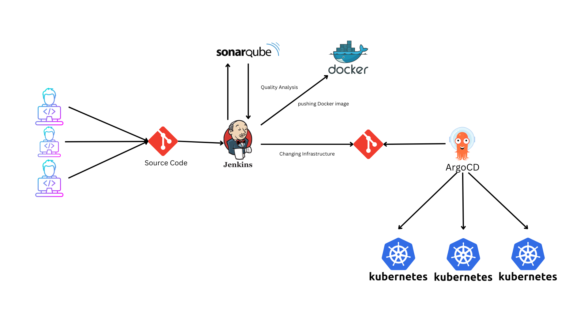

# voting-result-app

-   On the cluster, we have a Python voting app that collects voting data from users.
-   The voting app passes the data to a Redis cache, which is a tool for storing and quickly retrieving data.
-   A .NET worker node is constantly checking the Redis cache for new data. When it finds new data, it processes it and stores it in a PostgreSQL database.
-   A Node.js application is connected to the PostgreSQL database and displays the voting result to end users.

## CI/CD

Continuous integration using jenkins and Continuous delivery to k8s cluster using ArgoCD

